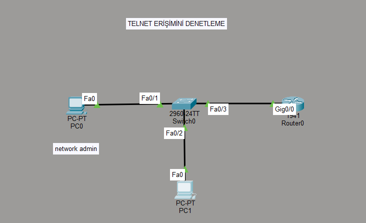

Cisco Router Telnet ve ACL Yapılandırması

📌 Proje Amacı

Bu projede bir Cisco Router üzerinde:

Telnet ile uzaktan erişim yapılandırılmıştır.
VTY hatları aktif edilmiştir.
ACL (Access Control List) kullanılarak erişim kontrolü sağlanmıştır.
Sadece belirli bir IP adresinin routera Telnet ile bağlanmasına izin verilmiştir.

🖥️ Topoloji

PC0 → 192.168.1.3 (Yetkili - Bağlanabilir)

PC1 → 192.168.1.4 (Yetkisiz - Engellenir)

Router → 192.168.1.1

Switch → Layer 2 cihaz

⚙️ Yapılan İşlemler

1️⃣ Router IP Yapılandırması

enable

configure terminal

interface gig0/0

ip address 192.168.1.1 255.255.255.0

no shutdown

exit

2️⃣ Enable Şifresi Tanımlama

enable secret cisco

3️⃣ Telnet (VTY) Yapılandırması

line vty 0 4

password cisco

login

transport input telnet

exit

4️⃣ ACL Oluşturma

Sadece 192.168.1.3 IP adresine izin verilmiştir:

access-list 10 permit 192.168.1.3
access-list 10 deny any

5️⃣ ACL’nin VTY Hattına Uygulanması

line vty 0 4
access-class 10 in
exit

🧪 Test Sonuçları

Cihaz	                Telnet Sonucu
PC0 (192.168.1.3)	✅ Bağlanabiliyor
PC1 (192.168.1.4)	❌ Engelleniyor

🧠 Bu Projeden Öğrenilenler

Telnet ile router’a uzaktan erişim sağlama
VTY hatlarının yapılandırılması
Enable secret kullanımı
Standart ACL yazımı
ACL’nin VTY hattına uygulanması
Implicit deny mantığı

🔒 Güvenlik Notu

Telnet şifreleri şifrelemez. Gerçek ağ ortamlarında Telnet yerine SSH kullanılması önerilir.

